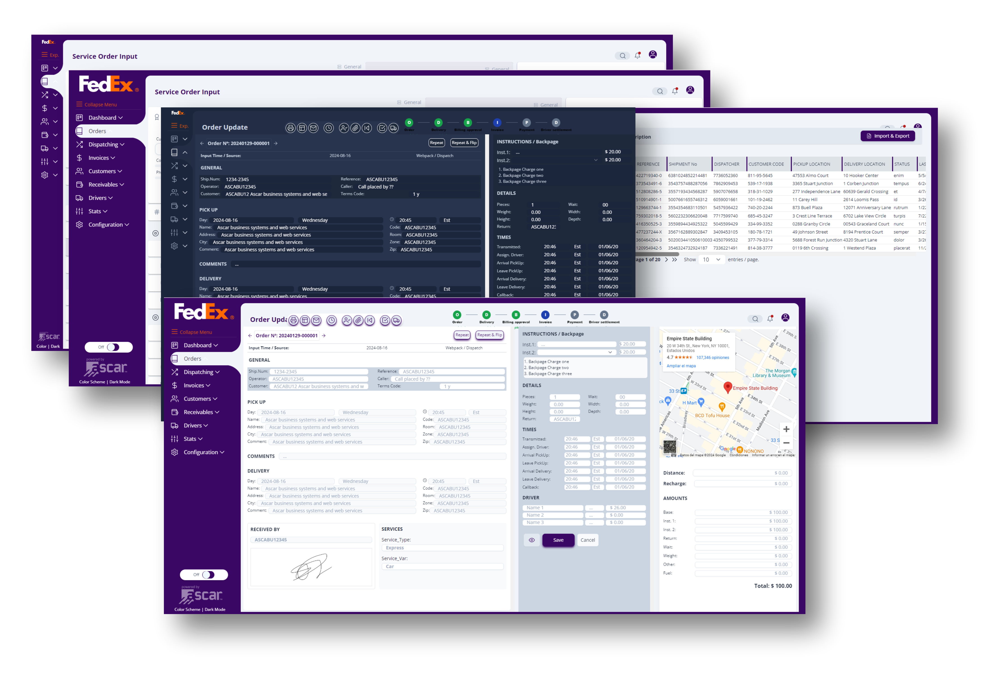

# ${\color{red}ASCAR-PROJECT}$
_nueva versión del sitio 2024_

### Diseño y desarrollo Front-end: ${\color{violet}Julia Funes}$ |  [www.jefa-web.com.ar](https://www.jefa-web.com.ar)

## El proyecto ofrece un servicio completo de administración para empresas de logística dentro de U.S.A..
**Se accede mediante suscripción paga.**

### ${\color{red}Tecnologías}$ implementadas en el desarrollo y diseño del Front-end: 
* Figma,
* React js.,
* GraphQl,
* Amazon S3,
* Redux toolkit,
* Vite,
* Tailwind css,
* Corel Draw,
* Librerías y complementos: 
    * react-to-print,
    * google-Maps,
    * left4code,
    * oauthGoogle,
    * html2canvas,
    * jspdf,
    * litepicker,
    * Lucide-react,
    * tiny-slider,
    * y otros.

### ${\color{red}Comandos}$ útiles: 
* npm install
* npm run dev
* npm run build

### ${\color{red}Componentes:}$

* Login,
* Menú lateral colapsable a necesidad,
* Personalización de Themes (gama de colores),
* DarkMode,
* Panel Administrador para personalización particular del sitio,
* Diferentes perfiles de usuarios,
* Flujo completo de ordenes de trabajo: creación, edición, etc.

  ### ${\color{violet}El-proyecto-se-pausó-hasta-nuevo-aviso-por-razones-de-fuerza-mayor.}$
  Referencias: Ascar.com
